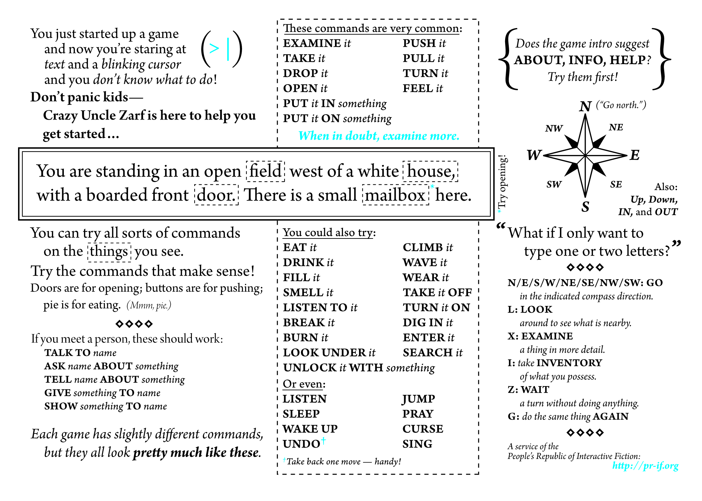
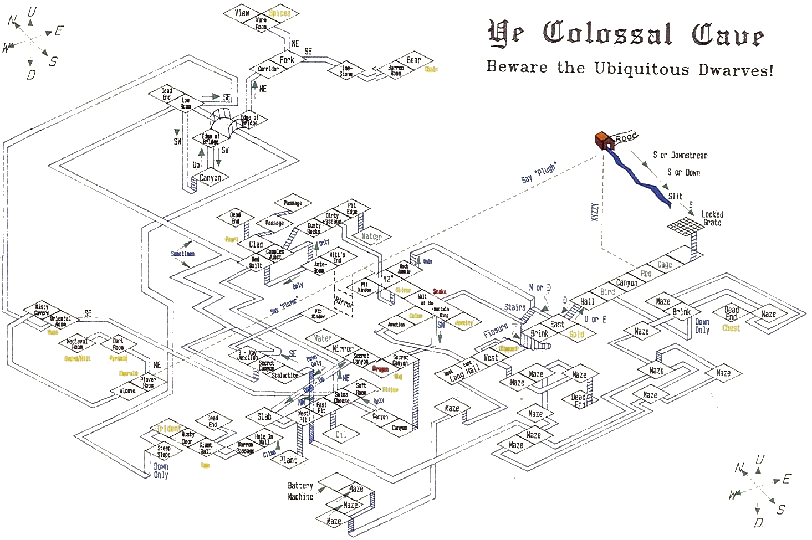

# adventure-dascript
Port of 1975 Colossal Cave Adventure to daScript

Colossal Cave Adventure (also known as ADVENT, Colossal Cave, or Adventure) is a text adventure game, developed between 1975 and 1977 by Will Crowther for the PDP-10 mainframe. The game was expanded upon in 1977 with help from Don Woods, and other programmers created variations on the game and ports to other systems in the following years.

In the game, the player controls a character through simple text commands to explore a cave rumored to be filled with wealth. Players earn predetermined points for acquiring treasure and escaping the cave alive, with the goal to earn the maximum number of points offered. The concept bore out from Crowther's background as a caving enthusiast, with the game's cave structured loosely around the Mammoth Cave system in Kentucky.

Colossal Cave Adventure is the first known work of interactive fiction and, as the first text adventure game, is considered the precursor for the adventure game genre. Colossal Cave Adventure also contributed towards the role-playing and roguelike genres.

https://en.wikipedia.org/wiki/Colossal_Cave_Adventure

Today the game is in the public domain.

https://en.wikipedia.org/wiki/List_of_open-source_video_games

Jay R. Jaegar converted the original Adventure to BDS C, and added separate values for treasures, survival and score.
The BDS code was converted to Unix by Jerry D. Pohl.
I've ported this version to daScript.

## General instructions for interactive fiction games

## Pen plotter map

## How to play
Run the start.bat

Part of the frustrating part with this game is you WANT to do something but you can't figure out HOW to do it. A lot of the time, it's because it's not something you CAN do

Here are some commands that you need to know

    help
    ? ?
    look
    unlock grate with keys
    throw axe at dwarf
    fill bottle
    take bear
    throw bear
    xyzzy (in debris room)
    plugh (in Y2 room)
    plover (in plover room)
    blast (in very final room)

NOTE: the lamp is NOT an oil lamp so you can't fill it with oil! You should be able to solve the game, but if you really want to, you can buy a new BATTERY at the vending machine in the maze. It does mean you can't get top prize, because you lose your coins doing this.

Scoring Levels

The more points you get, the higher your scoring rank gets. You can type SCORE at any point to see what your score is.

    68, 87 - Adventurer
    117 - Experienced Adventurer
    159, 199 - Seasoned Adventurer
    233, 263 - Junior Master
    304 - Master 2nd Class
    366 - Master 1st Class 
    
Getting In to the Caves

    'Enter' building
    'take' the keys and lamp
    Go 'out' of the building
    Go down, down to the slit in the rock
    Go South to the grate
    Unlock grate with key
    Open grate
    Go down
    Go west
    take the cage
    Go west again
    turn on the lamp
    Take the rod and say XYZZY. POOF you're back in the well house! Say XYZZY again to return to the Debris Room.
    Go west to the sloping room
    Drop the rod
    Go west to the Orange River Chamber
    Grab the bird (it's afraid of the rod)
    Now go east and get the rod
    Head back west again
    Go down into the pit, You're in the caves!
